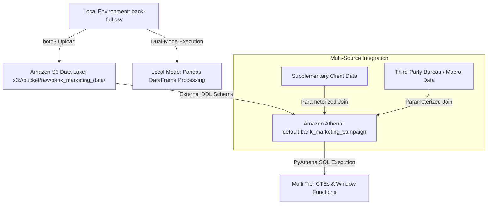

# AWS Cloud & Data Pipelines

## Overview

Cloud infrastructure sandbox and analytics pipeline designed to stage raw financial datasets, automate serverless ETL workflows, and execute interactive analytical queries.

- **Business Objective:** Model customer conversion probabilities for bank term deposits and evaluate financial tiers using balance decile segmentation (`NTILE`) to optimize direct marketing campaign outreach.
- **Data Source:** UCI Bank Marketing Campaign Dataset (`bank-full.csv`) as the base table to merge household_credit, digital_activity, and customer_transactions tables based on primary keys from the merging files.
  
-  Resulting analytics dataset has 45,211 rows and 146 attributes detailing direct telemarketing interactions, credit, and demographic data.

## Data Architecture



## Tooling & Architecture

### Core Components

- **Storage & Data Lake:** Amazon S3
- **Compute & Automation:** AWS Lambda (boto3)
- **Interactive SQL Engine:** Amazon Athena

### Pipeline Execution & Verification

The pipeline submits string-interpolated, multi-statement SQL workloads to Amazon Athena for distributed execution. Analytical tables are then queried and a 100-row sample is ingested into a local Pandas DataFrame for data quality validation and verification.

## Analytical Environment & Frameworks

### Data Processing & Analytics

- pandas
- NumPy
- Advanced Python SQL
  - Merge Multiple Data Sources
  - Common Table Expressions (CTEs)
  - Window Functions (`NTILE`, `DENSE_RANK`)
- Python Scripts
  - Data Preprocessing
  - Feature Engineering
  - Data Validation
  - **Final Output:** Clean Analytics Dataset

### Upcoming Analytics Projects

#### Predictive Modeling

- scikit-learn
- Ridge Regression
- Random Forest
- XGBoost
- SciPy

#### Model Validation

- statsmodels
- k-Fold Cross-Validation
- Qini Curve Metrics

## Getting Started & Execution

This repository supports dual-mode execution for local script validation and cloud-native serverless deployment.

### Local Pandas Execution Mode

#### 1. Save the Dataset

Ensure `bank-full.csv` is saved locally.

Example:

```text
C:\Users\User\00-aws-cloud-sandbox\bank-full.csv
```

#### 2. Load the Dataset

```python
import pandas as pd

df = pd.read_csv(
    r"C:\Users\User\00-aws-cloud-sandbox\bank-full.csv",
    sep=";"
)
```

#### 3. Execute the Pipeline

Run either:

- `s3_athena_etl_pipeline.py.ipynb`
- `s3_athena_etl_pipeline.py.py`

This executes:

- Decile metric calculations
- Conversion mapping
- Customer segmentation
- Summary rankings

### Cloud AWS S3 & Athena Mode

#### 1. Configure AWS Credentials

Configure your active AWS credentials and default region.

Example:

```text
us-east-1
```

#### 2. Update Bucket Configuration

Modify the bucket configuration variable:

```python
S3_BUCKET_NAME = "your-bucket-name"
```

#### 3. Execute Cloud Pipeline

Execute the pipeline functions sequentially to:

1. Upload raw CSV assets to Amazon S3
2. Create external table DDL definitions in Amazon Athena
3. Run multi-tier SQL transformations via PyAthena
4. Retrieve and validate analytical outputs

## Repository Workflow

```text
                    AWS CLOUD ANALYTICS SANDBOX

                      Raw Source Files
                              │
                              ▼
                     Amazon S3 Data Lake
                              │
                              ▼
                   Athena External Tables
                              │
                              ▼
                 Athena Consolidation Query
                   (LEFT JOIN Integration)
                              │
                              ▼
                Consolidated Analytics Dataset
                              │
                              ▼
                 Pandas Data Quality Audit
                              │
                              ▼
                 Data Cleaning & Preparation
                              │
                              ▼
                    Feature Engineering
                              │
                              ▼
                 Final Analytics Dataset

                 final_analytics_ready_dataset.csv
```
