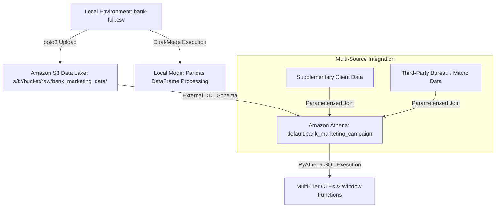

# AWS Cloud & Data Pipelines

## Overview

Cloud infrastructure sandbox and analytics pipeline designed to stage raw financial datasets, automate serverless ETL workflows, and execute interactive analytical queries.  
* **Business Objective:** Model customer conversion probabilities for bank term deposits and evaluate financial tiers using balance decile segmentation (`NTILE`) to
    optimize direct marketing campaign outreach.
  
* **Data Source:** UCI Bank Marketing Campaign Dataset (`bank-full.csv`), featuring 45,211 rows and 17 attributes detailing direct telemarketing interactions.

## Data Architecture



## Tooling & Architecture
* **Storage & Data Lake: Amazon S3** 

* **Compute & Automation: AWS Lambda (boto3)** 

* **Interactive SQL Engine: Amazon Athena** 

### Local Pandas Execution Mode

1. Ensure `bank-full.csv` is saved in your local directory (e.g., `C:\Users\User\00-aws-cloud-sandbox\bank-full.csv`).
2. Load the dataframe using the correct semicolon separator required for the UCI dataset:
   ```python
   import pandas as pd
   df = pd.read_csv(r"C:\Users\User\00-aws-cloud-sandbox\bank-full.csv\bank-full.csv", sep=";")
   

* **Pipeline Execution & Verification:** Submits string-interpolated, multi-statement SQL workloads to Amazon Athena for distributed execution, subsequently querying generated analytical tables to ingest a 100-row sample into a localized Pandas DataFrame for quality validation.

## Analytical Environment & Frameworks

* **Data Processing & Analytics:** pandas, NumPy, Advanced SQL (CTEs, Window Functions via NTILE and DENSE_RANK)

* **Predictive Modeling:** scikit-learn (Ridge Regression, Random Forest), LightGBM, SciPy

* **Model Validation:** statsmodels, k-Fold Cross-Validation, Qini Curve Metrics

## Getting Started & Execution

This repository supports dual-mode execution for local script validation and cloud-native serverless deployment.

### Local Pandas Execution Mode

1. Ensure `bank-full.csv` is saved in your local directory (e.g., `C:\Users\User\00-aws-cloud-sandbox\bank-full.csv`).
2. Load the dataframe using the correct semicolon separator required for the UCI dataset:
   ``` python
   import pandas as pd
   df = pd.read_csv(r"C:\Users\User\00-aws-cloud-sandbox\bank-full.csv\bank-full.csv", sep=";")
   

3. Open and run s3_athena_etl_pipeline.py.ipynb or execute the script s3_athena_etl_pipeline.py_2.py directly to run local decile metrics, conversion mapping, and summary
   rankings.

## Cloud AWS S3 & Athena Mode

1. Configure your active AWS credentials and default region (us-east-1).

2. Update the S3 bucket variables (S3_BUCKET_NAME) in the script configuration block.

3. Execute the pipeline functions sequentially to upload raw CSV assets to S3, create external table DDL definitions in Athena, and query multi-tier SQL data pipelines via 
   pyathena.
